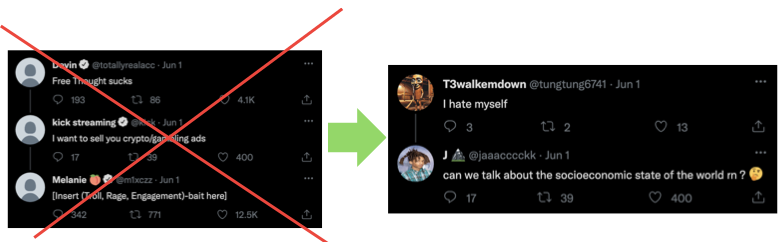

# betterX

Lightweight Chromium Extension that hides verified user posts and comments on X, because they suck and you cannot seem to block them all.

## Installation

This extension is not published on the Chrome Web Store, so it has to be loaded manually as an unpacked extension.

1. Download or clone this repository to a folder on your computer.
2. Open Chrome (or any Chromium-based browser) and go to `chrome://extensions`.
3. Enable "Developer mode" using the toggle in the top right corner.
4. Click "Load unpacked" and select the folder you downloaded in step 1.
5. The betterX icon will appear in your browser toolbar. Click it to turn hiding of verified posts on or off.

To update the extension after pulling new changes, go back to `chrome://extensions` and click the reload icon on the betterX card.
